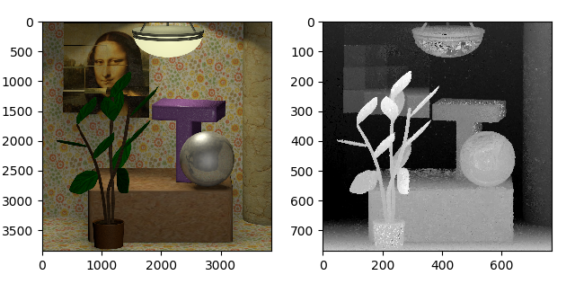

# CAE-Mobile-GPU

[](https://travis-ci.org/joemccann/dillinger)

This respitory contains code from Light Field Depth Estimation on Off-the-Shelf Mobile GPU - CVPRW 2018.

Only core parts of the code are included (C and GPU code)

The synthetic light field image are obtained from [HCI](http://hci-lightfield.iwr.uni-heidelberg.de/) and real light field image are captured using Lytro illum and decoded using [Light Field Toolbox](http://hci-lightfield.iwr.uni-heidelberg.de/). The light field are decoded into a .png format and cropped into a 5x5 angular resolution due to Android memory limitation. Samples of light field images used in the paper are included in the [LightField ](https://github.com/andreivan/CAE-Mobile-GPU/tree/master/LightField) folder.

The Android.mk and application.mk files are included to enable OpenCL on Android. The neccesarry OpenCL include and .so files are also included.

*The android .apk files are available by request.

### Libraries

| Libraries | Link |
| ------ | ------ |
| OpenCL | https://www.khronos.org/opencl/ |
| Android Studio SDK+NDK | https://developer.android.com/studio |
| Light Field Image | http://hci-lightfield.iwr.uni-heidelberg.de/ |
| Light Field Toolbox | https://dgd.vision/Tools/LFToolbox/ |

### Hardwares

| Cameras | Link |
| ------ | ------ |
| Lytro Illum | https://en.wikipedia.org/wiki/Lytro |
| Samsung S7 | - |


### Python wrapper 

python script that runs on cross-platform supporting pyopencl.


<div></div>


#### Requirements

- numpy
- opencv-python
- matplotlib
- tqdm
- pyopencl


#### Install pyopencl

- Linux

```
pip install pyopencl
```

- Windows
  - https://wiki.tiker.net/PyOpenCL/Installation/Windows/


#### Run the code

```
python lf_depth.py
```


License
----

MIT

[//]: # "These are reference links used in the body of this note and get stripped out when the markdown processor does its job. There is no need to format nicely because it shouldn't be seen. Thanks SO - http://stackoverflow.com/questions/4823468/store-comments-in-markdown-syntax"


[dill]: <https://github.com/joemccann/dillinger>
[git-repo-url]: <https://github.com/joemccann/dillinger.git>
[john gruber]: <http://daringfireball.net>
[df1]: <http://daringfireball.net/projects/markdown/>
[markdown-it]: <https://github.com/markdown-it/markdown-it>
[Ace Editor]: <http://ace.ajax.org>
[node.js]: <http://nodejs.org>
[Twitter Bootstrap]: <http://twitter.github.com/bootstrap/>
[jQuery]: <http://jquery.com>
[@tjholowaychuk]: <http://twitter.com/tjholowaychuk>
[express]: <http://expressjs.com>
[AngularJS]: <http://angularjs.org>
[Gulp]: <http://gulpjs.com>

[PlDb]: <https://github.com/joemccann/dillinger/tree/master/plugins/dropbox/README.md>
[PlGh]: <https://github.com/joemccann/dillinger/tree/master/plugins/github/README.md>
[PlGd]: <https://github.com/joemccann/dillinger/tree/master/plugins/googledrive/README.md>
[PlOd]: <https://github.com/joemccann/dillinger/tree/master/plugins/onedrive/README.md>
[PlMe]: <https://github.com/joemccann/dillinger/tree/master/plugins/medium/README.md>
[PlGa]: <https://github.com/RahulHP/dillinger/blob/master/plugins/googleanalytics/README.md>
